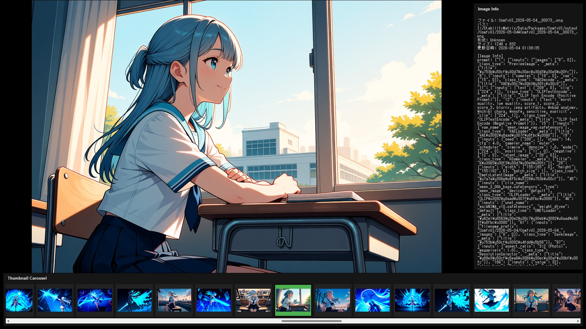

# **フォルダ監視型 フルスクリーン画像ビュアー 取扱説明書**
本アプリは、指定したフォルダを監視しながら画像をフルスクリーンでスライドショー再生するアプリケーションです。末尾まで到達した後も、新しいファイルが追加されると自動で取り込んで再生対象に加えます。

ブラウザのセキュリティ制限を越えてローカルフォルダを直接監視するため、**Python**を使用して動作します。

## **主な特長**

* **生成中フォルダをそのまま監視**: ローカルで画像生成を回し続けているフォルダを監視し、新規画像を自動でスライドショー対象に追加できます。
* **メタ情報表示モード**: A1111 WebUI の PNG info や EXIF など、読み取れる範囲の画像メタ情報を表示できます。
* **タブレットでも扱いやすい操作系**: タッチ、スワイプ、中央タップ操作に対応し、タブレットPCやリモートデスクトップ経由の操作でも使いやすくしています。



## **導入手順**

### **1. 前提**

本アプリを動かすには、PC に **Python 3** の実行環境が必要です。

### **Windows**

* [Python公式サイト (python.org)](https://www.python.org/downloads/) からインストーラーをダウンロードします。  
* インストーラーを起動したら、**画面下部の Add python.exe to PATH (または Add Python to PATH) にチェックを入れてから** Install Now をクリックしてください。

### **macOS / Linux**

* ターミナルで `python3 --version` を実行し、Python 3 が使えることを確認してください。  
* 未導入の場合は、各OSの標準的な方法で Python 3 をインストールしてください。

### **2. ファイルを置く**

同じフォルダに以下を置いてください。

### **Windows**

* `viewer.py`
* `start.bat` または `start.ps1`

### **macOS / Linux**

* `viewer.py`
* `start.sh`

### **3. まずはそのまま起動する**

起動スクリプトは、リポジトリ内の `.venv` を優先して使います。`.venv` がまだ無い場合は、初回起動時に自動作成して必要パッケージを入れます。

### **Windows**

* `start.bat` をダブルクリック  
* PowerShell から起動する場合: `powershell -ExecutionPolicy Bypass -File .\start.ps1`

### **macOS / Linux**

```bash
chmod +x ./start.sh
./start.sh
```

準備が完了すると、自動的に設定画面が立ち上がります。

### **4. 依存パッケージだけ先に入れたい場合（任意）**

初回起動時の自動セットアップを待たず、依存パッケージを先に入れておきたい場合は、次のインストールスクリプトを使ってください。依存関係はどの方法でもリポジトリ内の `.venv` に入ります。

### **Windows**

* `install.bat` をダブルクリック  
* PowerShell の場合: `powershell -ExecutionPolicy Bypass -File .\install.ps1`

### **macOS / Linux**

```bash
chmod +x ./install.sh
./install.sh
```

インストール後の起動は `start.bat` / `start.ps1` / `start.sh` を使ってください。

## **使い方**

### **1\. 設定画面**

起動すると、グレーの背景の設定メニューが表示されます。

* **\[1. フォルダを選択\]**: 監視・表示したい画像が入っているフォルダを選びます。  
* **\[自動送り間隔 (秒)\]**: 何秒ごとに画像を切り替えるか、数字を入力します（デフォルトは5秒）。  
* **\[2. スライドショー開始\]**: 設定を終えたら、このボタンを押すとフルスクリーンで再生が始まります。画像は画面の縦横比に合わせて自動で最大化（拡大・縮小）されます。

### **2\. 再生中の操作**

再生中はメニューが隠れ、フルスクリーンになります。キーボードのほか、マウスやタッチパネル（タブレット等）での直感的な操作が可能です。

**【キーボード操作】**

* **Esc キー**: 再生中の表示モードを切り替えます。フルスクリーン中ならウィンドウモードへ、ウィンドウモード中ならフルスクリーンへ戻ります。  
* **→ キー / Space キー**: 手動で次の画像に進みます。  
* **← キー**: 手動で前の画像に戻ります。  
* **Ctrl + C**: 現在表示中の画像をクリップボードにコピーします。Windows で利用できます。  
* **P キー**: 自動再生の一時停止／再開を切り替えます。

**【マウス・タッチパネル操作】**

* **画面の右側（1/3）をタップ（クリック）**: 次の画像に進みます。  
* **画面の左側（1/3）をタップ（クリック）**: 前の画像に戻ります。  
* **左右にスワイプ（ドラッグ）**: スマホのように、スワイプ操作でも前後の画像に切り替えられます。  
* **画面の中央をタップ（クリック）**: 画面下部に**操作パネル**が表示されます。ここからシークバー操作、停止 / 再開、スライドショー間隔の調整、最大化切替、対象フォルダ変更、サムネイル帯表示、情報欄表示、設定画面への復帰、アプリ終了ができます。もう一度中央をタップするか、パネルの「閉じる」で消えます。
* **画像を右クリック**: コンテキストメニューから、現在表示中の画像をクリップボードにコピーしたり、ファイルマネージャで位置を開いたりできます。Windows では選択表示、macOS では Finder で表示、Linux では親フォルダを開きます。

* **操作パネルの「最大化 / 最大化解除」**: 再生を止めずに、フルスクリーン表示と通常ウィンドウ表示を切り替えます。
* **操作パネルの「フォルダ変更」**: 再生中のまま対象フォルダを切り替えます。変更後は新しいフォルダの内容を読み直し、監視対象も自動で切り替わります。
* **操作パネルの「サムネイル表示」**: 電子文書ビューアのページ帯のような下部サムネイルカルーセルを表示できます。表示中はそのぶんメイン画像の表示領域が自動調整されます。
* **操作パネルの「情報欄表示」**: 画面右側の情報欄を表示できます。A1111 WebUI の PNG info や EXIF など、読み取れる範囲の情報を画像切替に合わせて更新します。
* **操作パネルの「設定画面へ戻る」**: 再生を終了し、フォルダ選択や秒数指定を行う設定画面へ戻ります。
* **操作パネルの「終了」**: アプリを終了します。フルスクリーン表示中でも使えます。

### **3\. 待機機能について（コア機能）**

* フォルダ内の画像を最後まで表示し終えると、画面はそのまま（最後の画像を表示した状態）で待機モードに入ります。  
* その状態で、設定したフォルダの中に新しく画像ファイル（.png, .jpgなど）が保存されると、アプリがそれを瞬時に検知し、自動的に新しい画像を画面に表示してスライドショーを再開します。
* 画像の表示順は、**ファイルの更新日時順（古いものから順）**で統一されます。起動時に存在していた画像も、あとから追加された画像も同じルールで並びます。

## **注意事項**

* **Canvas外での利用について:** 本アプリはPC内のフォルダを監視する性質上、Webブラウザ（CanvasやGoogleサイト）の中では動作しません。必ず上記の「ローカルPCでの実行」手順でご利用ください。  
* **Gemini API（AI機能）について:** 本アプリは生成AI機能を使用していないため、APIキーの設定等は一切不要です。情報漏洩の心配なく社内ネットワーク内で安全にご利用いただけます。
* **監視範囲について:** フォルダ監視の対象は、選択したフォルダの**直下のみ**です。サブフォルダ内の画像は自動取り込み対象になりません。  
* **GIF の扱いについて:** `.gif` は読み込み対象ですが、アニメーション再生ではなく静止画として扱われます。

## **開発者向けデバッグ起動**

通常の起動スクリプト (`start.bat` / `start.ps1` / `start.sh`) では、デバッグ機能は有効になりません。  
開発時だけ、`viewer.py` を直接起動して `--debug` オプションを指定してください。

例:

```bash
python viewer.py --debug resize
python viewer.py --debug resize,timeline
python viewer.py --debug resize,timeline,hud
```

指定できる項目:

* `resize`: リサイズまわりの詳細ログを標準出力へ表示
* `timeline`: 画像切替や再描画の時系列ログを標準出力へ表示
* `hud`: 画面左上に軽量なデバッグ HUD を表示

これらは開発者向け機能です。通常利用や配布時は、起動スクリプト経由の起動を推奨します。

## **更新履歴**

* **v1.7**  
  * 【機能追加】現在表示中の画像を右クリックメニューまたは `Ctrl + C` でクリップボードへコピーできるように変更。  
  * 【機能追加】現在表示中の画像を右クリックメニューからファイルマネージャで開けるように変更。  
  * 【改善】ポーズ中の手動送りやサムネイル選択時にも、サムネイル帯が現在画像へ追従しやすいよう挙動を調整。  
* **v1.6**  
  * 【改善】依存パッケージ定義を `requirements.txt` に整理。  
  * 【機能追加】Windows / macOS / Linux 向けの `install` スクリプトを追加。  
  * 【改善】起動スクリプトをリポジトリ内 `.venv` を優先する構成に変更。  
* **v1.5**  
  * 【機能追加】サムネイルカルーセルの表示 / 非表示と常時表示モードを追加。  
  * 【機能追加】画像メタ情報表示欄の表示 / 非表示切替を追加。  
  * 【改善】macOS / Linux 向けの起動スクリプト `start.sh` を追加。  
* **v1.4**  
  * 【機能追加】再生中の操作パネルに、最大化 / 最大化解除ボタンを追加。  
  * 【機能追加】再生中の操作パネルに、対象フォルダ変更ボタンを追加。  
* **v1.3**  
  * 【機能追加】再生中の操作パネルに、停止 / 再開ボタンとスライドショー間隔の調整UIを追加。  
  * 【改善】画像の表示順を更新日時ベースの時系列ソートに統一。  
* **v1.2**  
  * 【機能追加】マウス/タッチパネル操作に対応（左右タップ・スワイプでのページ送り）。  
  * 【機能追加】画面中央タップでシークバー（スクロールバー）を表示・操作できる機能を追加。  
  * 【改善】小さな画像も、画面サイズとアスペクト比に合わせて自動で拡大表示するように改善。  
* **v1.1**  
  * 【改善】起動用スクリプトを、より簡単に起動できるバッチファイル（start.bat）に変更（Windowsの実行ポリシー制限を回避）。  
* **v1.0 (初版)**  
  * フォルダ監視型のフルスクリーン画像ビューアーの基本機能を実装。
